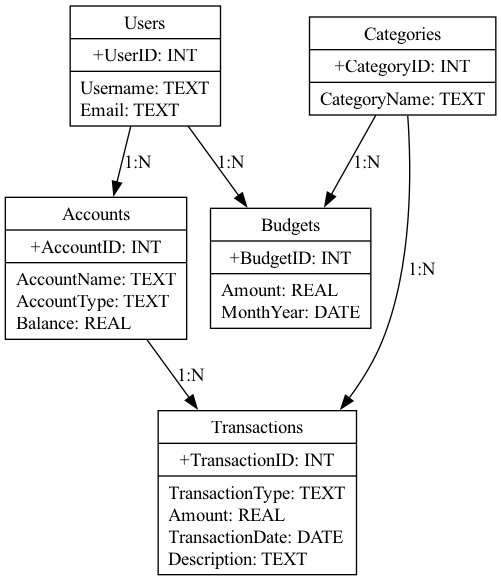

# Personal Finance Management App

## Overview

The Personal Finance Management App allows users to manage their financial transactions, set budgets, and generate reports to track their spending and budget adherence. The app provides functionalities to manage multiple accounts, categorize transactions, and set monthly budgets for different categories.

## Database Schema

The database consists of the following tables:
- **Users**: Stores user information.
- **Accounts**: Manages financial accounts related to a user.
- **Categories**: Manages different categories for budgeting and transactions.
- **Transactions**: Keeps track of all the user's income and expenses.
- **Budgets**: Manages budget details for different categories for a user.

## Files

- **finance_db_init.sql**: Contains SQL code to create the database schema.
- **data_insertion.sql**: Contains SQL code to insert mock data into the tables.
- **data_query.sql**: Contains SQL queries to retrieve data and answer relevant questions.
- **query_result.md**: Contains the expected results of the SQL queries.

## How to Use

1. **Initialize Database**: Run `finance_db_init.sql` to create the database schema.
2. **Insert Data**: Run `data_insertion.sql` to insert mock data into the tables.
3. **Run Queries**: Run `data_query.sql` to retrieve data and answer relevant questions.
4. **View Query Results**: Refer to `query_result.md` for expected results of the queries.

## ER Diagram

Below is the Entity-Relationship diagram of the database schema:

## Note

Ensure to validate the SQL code and mock data by running them in an SQLite3 shell before submission.