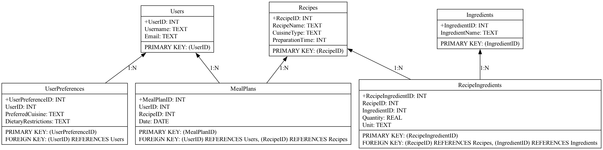

# Recipe Recommendation and Meal Planning App

## Overview

The Recipe Recommendation and Meal Planning App allows users to discover new recipes, plan meals, and manage dietary preferences. The app provides functionalities to explore various recipes, manage ingredients, and create meal plans while considering user preferences and dietary restrictions.

## Database Schema

The database consists of the following tables:
- **Users**: Stores user information.
- **Recipes**: Manages various recipes and their details.
- **Ingredients**: Manages different ingredients used in recipes.
- **RecipeIngredients**: Manages the relationship between recipes and ingredients.
- **MealPlans**: Manages meal plans, associating users with recipes on specific dates.
- **UserPreferences**: Manages user preferences for cuisine type and dietary restrictions.

## Files

- **recipe_db_init.sql**: Contains SQL code to create the database schema.
- **data_insertion_recipe.sql**: Contains SQL code to insert mock data into the tables.
- **data_query_recipe.sql**: Contains SQL queries to retrieve data and answer relevant questions.
- **query_result_recipe.md**: Contains the expected results of the SQL queries.

## How to Use

1. **Initialize Database**: Run `recipe_db_init.sql` to create the database schema.
2. **Insert Data**: Run `data_insertion_recipe.sql` to insert mock data into the tables.
3. **Run Queries**: Run `data_query_recipe.sql` to retrieve data and answer relevant questions.
4. **View Query Results**: Refer to `query_result_recipe.md` for expected results of the queries.

## ER Diagram

Below is the Entity-Relationship diagram of the database schema:

## Note

Ensure to validate the SQL code and mock data by running them in an SQLite3 shell before submission.